# XpertConnect UML Diagrams

---

## Table of Contents

| # | Diagram | Type | Description |
|---|---------|------|-------------|
| 1 | [Use Case Diagram](#1-use-case-diagram) | Behavioral | All actors and system interactions |
| 2 | [Class Diagram](#2-class-diagram) | Structural | Entity model with attributes and relationships |
| 3 | [Sequence - Auction Flow](#3-sequence-diagram---auction-flow) | Behavioral | End-to-end auction process |
| 4 | [Sequence - Professional Fee](#4-sequence-diagram---professional-fee-flow) | Behavioral | Consultation booking flow |
| 5 | [Sequence - Pro-Bono](#5-sequence-diagram---pro-bono-flow) | Behavioral | Social impact project flow |
| 6 | [Activity - Verification](#6-activity-diagram---verification-process) | Behavioral | User verification process |
| 7 | [Activity - Geofence](#7-activity-diagram---geofence-meeting-verification) | Behavioral | Meeting verification via GPS |
| 8 | [Component Diagram](#8-component-diagram) | Structural | System architecture and services |
| 9 | [State - Auction Lifecycle](#9-state-diagram---auction-lot-lifecycle) | Behavioral | Auction lot state transitions |
| 10 | [State - Consultation Lifecycle](#10-state-diagram---consultation-booking-lifecycle) | Behavioral | Booking state transitions |
| 11 | [ERD (Database Schema)](#11-entity-relationship-diagram-erd) | Structural | Database tables and relationships |

---

### Quick Reference by Category

**Structural Diagrams** (What the system IS)
- [Class Diagram](#2-class-diagram) - Domain model
- [Component Diagram](#8-component-diagram) - Architecture
- [ERD](#11-entity-relationship-diagram-erd) - Database schema

**Behavioral Diagrams** (How the system WORKS)
- [Use Case Diagram](#1-use-case-diagram) - User interactions
- [Sequence Diagrams](#3-sequence-diagram---auction-flow) - Process flows
- [Activity Diagrams](#6-activity-diagram---verification-process) - Workflows
- [State Diagrams](#9-state-diagram---auction-lot-lifecycle) - Lifecycles

---

## 1. Use Case Diagram

```plantuml
@startuml UseCaseDiagram
left to right direction
skinparam packageStyle rectangle

actor "Seeker" as seeker
actor "Expert\n(Accomplished Mind)" as expert
actor "Platform Admin" as admin
actor "Concierge" as concierge
actor "Non-Profit Org" as nonprofit
actor "Escrow Agent" as escrow

rectangle "XpertConnect Platform" {
    ' Authentication & Registration
    package "Registration & Verification" {
        usecase "Register Account" as UC1
        usecase "Complete KYC Verification" as UC2
        usecase "Submit Financial References" as UC3
        usecase "Verify Expert Credentials" as UC4
        usecase "Categorize Expert (A/B/C)" as UC5
    }

    ' Auction Model
    package "Auction Model" {
        usecase "Create Auction Lot" as UC6
        usecase "Define Meeting Parameters" as UC7
        usecase "Pre-Register for Auction" as UC8
        usecase "Approve Bidder" as UC9
        usecase "Place Bid" as UC10
        usecase "Set Proxy Bid" as UC11
        usecase "Buy Now" as UC12
        usecase "Close Auction" as UC13
        usecase "Fund Escrow" as UC14
    }

    ' Professional Fee Model
    package "Professional Fee Model" {
        usecase "Create Expert Profile" as UC15
        usecase "Set Availability & Rates" as UC16
        usecase "Browse Experts" as UC17
        usecase "Book Consultation" as UC18
        usecase "Execute Digital NDA" as UC19
        usecase "Process Payment" as UC20
        usecase "Conduct Session" as UC21
        usecase "Provide Feedback" as UC22
    }

    ' Pro-Bono Model
    package "Pro-Bono Model" {
        usecase "Define Project Need" as UC23
        usecase "Browse Social Causes" as UC24
        usecase "Apply for Project" as UC25
        usecase "Match Expert to Project" as UC26
        usecase "Sign MOU" as UC27
        usecase "Track Volunteer Hours" as UC28
        usecase "Generate CSR Report" as UC29
    }

    ' Physical Meeting Logistics
    package "Physical Meeting Logistics" {
        usecase "Coordinate Meeting Logistics" as UC30
        usecase "Vet Venue Security" as UC31
        usecase "Book Executive Protection" as UC32
        usecase "Verify Meeting via Geofence" as UC33
        usecase "Release Escrow Funds" as UC34
    }

    ' Compliance & Admin
    package "Compliance & Administration" {
        usecase "Screen Against Sanctions" as UC35
        usecase "Monitor Compliance" as UC36
        usecase "Handle Disputes" as UC37
    }
}

' Seeker relationships
seeker --> UC1
seeker --> UC2
seeker --> UC3
seeker --> UC8
seeker --> UC10
seeker --> UC11
seeker --> UC12
seeker --> UC14
seeker --> UC17
seeker --> UC18
seeker --> UC19
seeker --> UC21
seeker --> UC22
seeker --> UC33

' Expert relationships
expert --> UC1
expert --> UC4
expert --> UC6
expert --> UC7
expert --> UC15
expert --> UC16
expert --> UC19
expert --> UC21
expert --> UC24
expert --> UC25
expert --> UC27
expert --> UC33

' Admin relationships
admin --> UC5
admin --> UC9
admin --> UC13
admin --> UC35
admin --> UC36
admin --> UC37

' Concierge relationships
concierge --> UC30
concierge --> UC31
concierge --> UC32

' Non-Profit relationships
nonprofit --> UC23
nonprofit --> UC26
nonprofit --> UC27
nonprofit --> UC29

' Escrow relationships
escrow --> UC14
escrow --> UC34
escrow --> UC37

' Include relationships
UC6 ..> UC7 : <<include>>
UC18 ..> UC19 : <<include>>
UC18 ..> UC20 : <<include>>
UC33 ..> UC34 : <<include>>

@enduml
```

---

## 2. Class Diagram

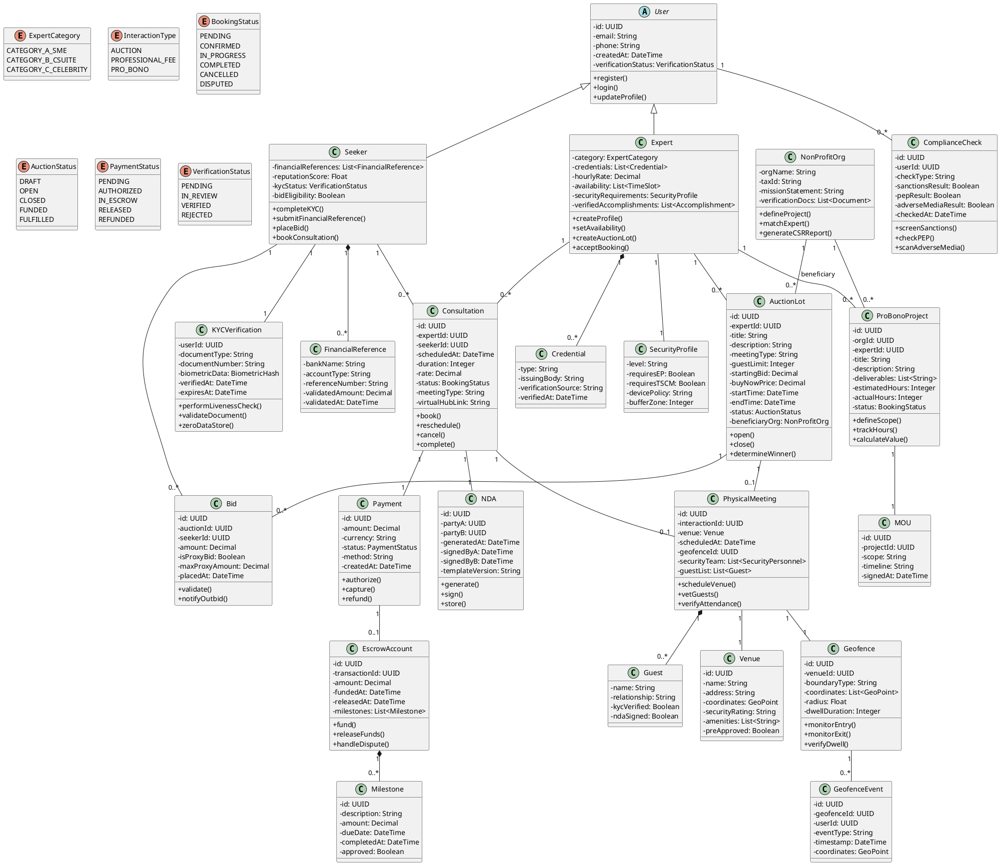

---

## 3. Sequence Diagram - Auction Flow

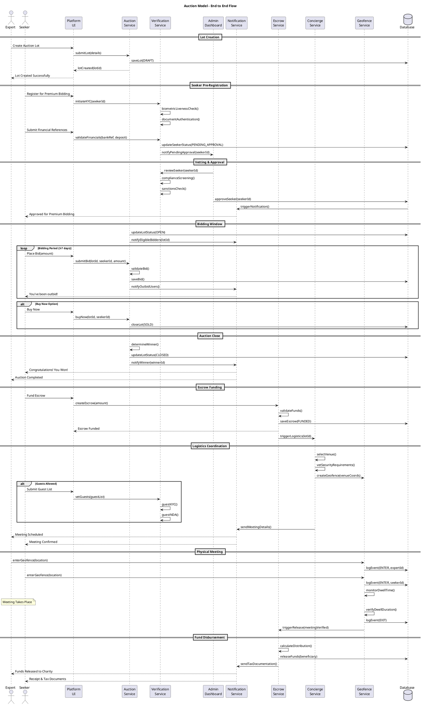

---

## 4. Sequence Diagram - Professional Fee Flow

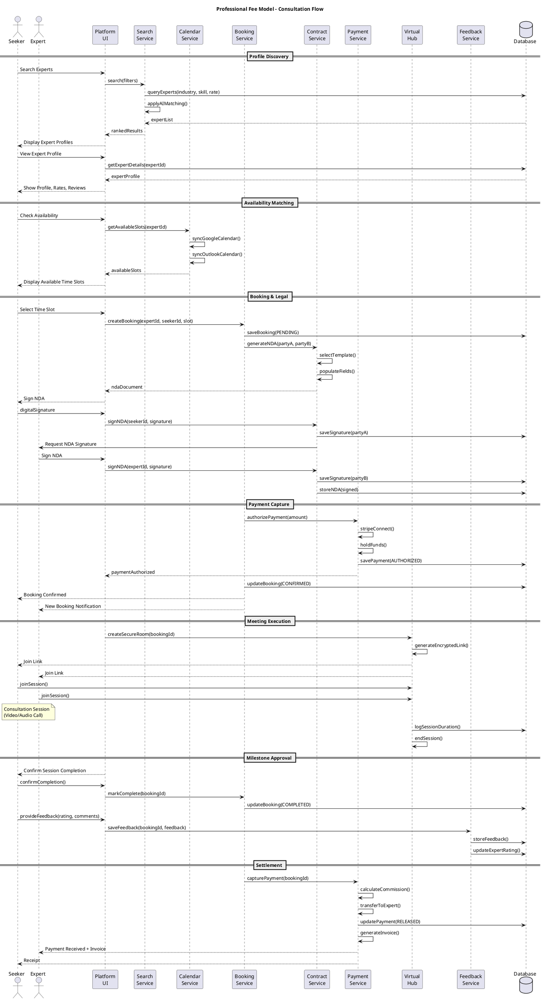

---

## 5. Sequence Diagram - Pro-Bono Flow

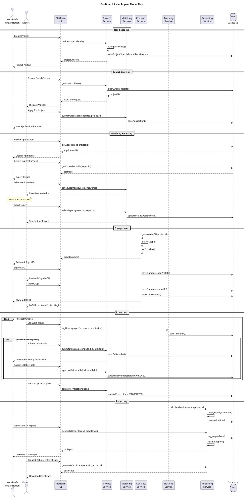

---

## 6. Activity Diagram - Verification Process

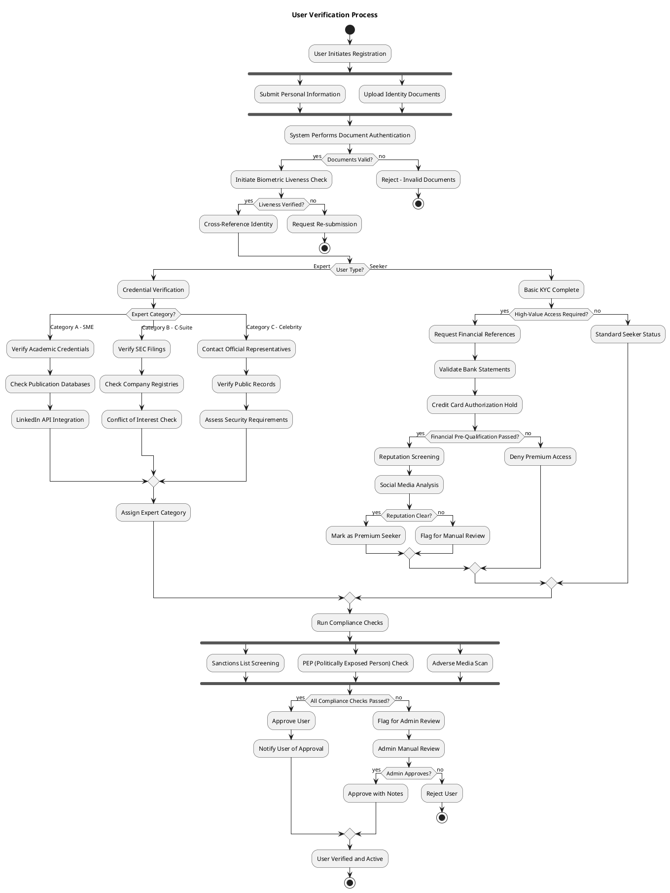

---

## 7. Activity Diagram - Geofence Meeting Verification

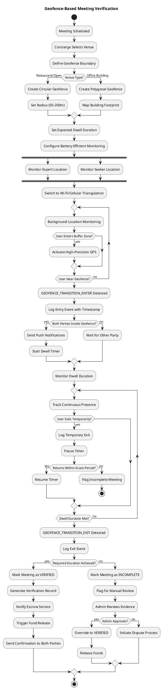

---

## 8. Component Diagram

```plantuml
@startuml ComponentDiagram
title XpertConnect Platform - Component Architecture

skinparam component {
    BackgroundColor<<external>> LightGray
}

package "Client Applications" {
    [Web Application] as WebApp
    [Mobile App (iOS)] as iOSApp
    [Mobile App (Android)] as AndroidApp
    [Admin Dashboard] as AdminDash
}

package "API Gateway" {
    [API Gateway / Load Balancer] as Gateway
    [Authentication Service] as AuthSvc
    [Rate Limiter] as RateLimiter
}

package "Core Services" {
    [User Service] as UserSvc
    [Expert Service] as ExpertSvc
    [Seeker Service] as SeekerSvc
    [Auction Service] as AuctionSvc
    [Booking Service] as BookingSvc
    [Project Service] as ProjectSvc
}

package "Verification & Compliance" {
    [KYC Service] as KYCSvc
    [Credential Verification] as CredSvc
    [Compliance Engine] as ComplianceSvc
    [Reputation Service] as ReputationSvc
}

package "Financial Services" {
    [Payment Service] as PaymentSvc
    [Escrow Service] as EscrowSvc
    [Invoice Service] as InvoiceSvc
    [Tax Documentation] as TaxSvc
}

package "Communication & Scheduling" {
    [Notification Service] as NotifySvc
    [Calendar Service] as CalendarSvc
    [Virtual Hub] as VirtualHub
    [Messaging Service] as MsgSvc
}

package "Physical Logistics" {
    [Concierge Service] as ConciergeSvc
    [Venue Service] as VenueSvc
    [Geofence Service] as GeoSvc
    [Security Coordination] as SecuritySvc
}

package "Contract & Legal" {
    [NDA Generator] as NDASvc
    [MOU Generator] as MOUSvc
    [Contract Storage] as ContractStore
}

package "Analytics & Reporting" {
    [Analytics Engine] as AnalyticsSvc
    [CSR Reporting] as CSRSvc
    [ROI Calculator] as ROISvc
}

package "AI & Matching" {
    [Smart Matching Engine] as MatchingEngine
    [Recommendation Service] as RecommendSvc
}

package "Data Layer" {
    database "Primary Database\n(PostgreSQL)" as PrimaryDB
    database "Search Index\n(Elasticsearch)" as SearchDB
    database "Cache\n(Redis)" as Cache
    database "Document Store\n(S3)" as DocStore
}

package "External Integrations" <<external>> {
    [Stripe Connect] as Stripe
    [Escrow.com API] as EscrowAPI
    [Google Calendar] as GCal
    [Outlook Calendar] as OCal
    [Ironclad CLM] as Ironclad
    [KYC Provider\n(Onfido/Jumio)] as KYCProvider
    [Sanctions Database] as SanctionsDB
    [LinkedIn API] as LinkedIn
    [SMS Gateway] as SMSGateway
    [Email Service] as EmailSvc
}

' Client to Gateway
WebApp --> Gateway
iOSApp --> Gateway
AndroidApp --> Gateway
AdminDash --> Gateway

' Gateway to Auth
Gateway --> AuthSvc
Gateway --> RateLimiter

' Auth to Services
AuthSvc --> UserSvc

' Core Service Connections
Gateway --> UserSvc
Gateway --> ExpertSvc
Gateway --> SeekerSvc
Gateway --> AuctionSvc
Gateway --> BookingSvc
Gateway --> ProjectSvc

' Verification Connections
UserSvc --> KYCSvc
ExpertSvc --> CredSvc
SeekerSvc --> ComplianceSvc
ComplianceSvc --> ReputationSvc

' Financial Connections
AuctionSvc --> EscrowSvc
BookingSvc --> PaymentSvc
PaymentSvc --> EscrowSvc
EscrowSvc --> InvoiceSvc
InvoiceSvc --> TaxSvc

' Communication Connections
AuctionSvc --> NotifySvc
BookingSvc --> NotifySvc
BookingSvc --> CalendarSvc
BookingSvc --> VirtualHub

' Logistics Connections
AuctionSvc --> ConciergeSvc
ConciergeSvc --> VenueSvc
ConciergeSvc --> GeoSvc
ConciergeSvc --> SecuritySvc

' Legal Connections
BookingSvc --> NDASvc
ProjectSvc --> MOUSvc
NDASvc --> ContractStore
MOUSvc --> ContractStore

' Analytics Connections
ProjectSvc --> CSRSvc
BookingSvc --> AnalyticsSvc
AnalyticsSvc --> ROISvc

' AI Connections
ExpertSvc --> MatchingEngine
SeekerSvc --> RecommendSvc
MatchingEngine --> RecommendSvc

' Data Layer Connections
UserSvc --> PrimaryDB
ExpertSvc --> PrimaryDB
AuctionSvc --> PrimaryDB
BookingSvc --> PrimaryDB
ExpertSvc --> SearchDB
SearchDB --> Cache
ContractStore --> DocStore

' External Integrations
PaymentSvc --> Stripe
EscrowSvc --> EscrowAPI
CalendarSvc --> GCal
CalendarSvc --> OCal
NDASvc --> Ironclad
KYCSvc --> KYCProvider
ComplianceSvc --> SanctionsDB
CredSvc --> LinkedIn
NotifySvc --> SMSGateway
NotifySvc --> EmailSvc

@enduml
```

---

## 9. State Diagram - Auction Lot Lifecycle

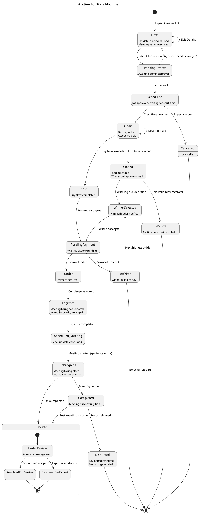

---

## 10. State Diagram - Consultation Booking Lifecycle

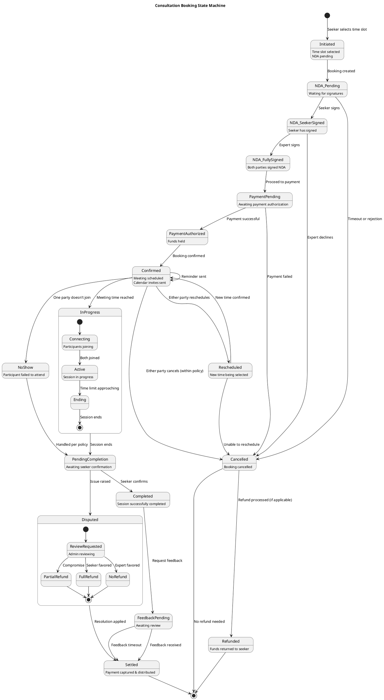

---

## 11. Entity Relationship Diagram (ERD)

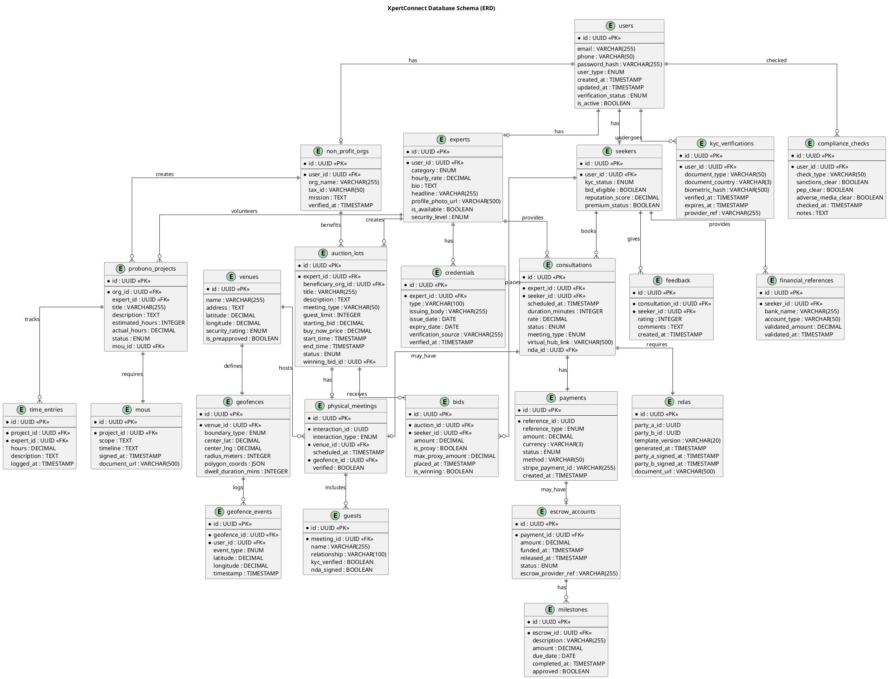

---

## How to Render These Diagrams

You can render these PlantUML diagrams using:

1. **Online Tools**:
   - [PlantUML Web Server](https://www.plantuml.com/plantuml/uml/)
   - [PlantText](https://www.planttext.com/)

2. **IDE Extensions**:
   - VS Code: "PlantUML" extension
   - IntelliJ: "PlantUML Integration" plugin

3. **Command Line**:
   ```bash
   java -jar plantuml.jar uml-diagrams.md
   ```

4. **Documentation Tools**:
   - Confluence (with PlantUML plugin)
   - GitLab/GitHub (with PlantUML rendering)
