# XpertConnect - Flow Diagrams

**Document Version:** 1.0
**Last Updated:** April 2026
**Format:** Mermaid Diagrams

---

## Table of Contents

1. [System Overview](#1-system-overview)
2. [User Registration & Verification Flow](#2-user-registration--verification-flow)
3. [Auction Flow](#3-auction-flow)
4. [Consultation Booking Flow](#4-consultation-booking-flow)
5. [Pro-Bono Project Flow](#5-pro-bono-project-flow)
6. [Payment & Escrow Flow](#6-payment--escrow-flow)
7. [Real-Time Bidding Flow](#7-real-time-bidding-flow)
8. [State Diagrams](#8-state-diagrams)
9. [Component Architecture](#9-component-architecture)
10. [Entity Relationship Diagram](#10-entity-relationship-diagram)

---

## 1. System Overview

### 1.1 High-Level System Architecture

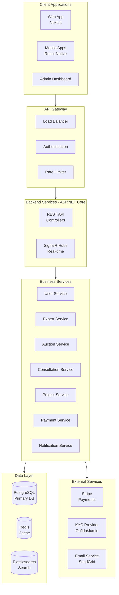
```mermaid
flowchart TB
    subgraph Clients["Client Applications"]
        WEB[Web App<br/>Next.js]
        MOBILE[Mobile Apps<br/>React Native]
        ADMIN[Admin Dashboard]
    end

    subgraph Gateway["API Gateway"]
        GW[Load Balancer]
        AUTH[Authentication]
        RATE[Rate Limiter]
    end

    subgraph Backend["Backend Services - ASP.NET Core"]
        API[REST API<br/>Controllers]
        HUB[SignalR Hubs<br/>Real-time]
    end

    subgraph Services["Business Services"]
        USER[User Service]
        EXPERT[Expert Service]
        AUCTION[Auction Service]
        CONSULT[Consultation Service]
        PROJECT[Project Service]
        PAYMENT[Payment Service]
        NOTIF[Notification Service]
    end

    subgraph Data["Data Layer"]
        PG[(PostgreSQL<br/>Primary DB)]
        REDIS[(Redis<br/>Cache)]
        ES[(Elasticsearch<br/>Search)]
    end

    subgraph External["External Services"]
        STRIPE[Stripe<br/>Payments]
        KYC[KYC Provider<br/>Onfido/Jumio]
        EMAIL[Email Service<br/>SendGrid]
    end

    Clients --> Gateway
    Gateway --> Backend
    Backend --> Services
    Services --> Data
    Services --> External
```

### 1.2 User Types and Interactions

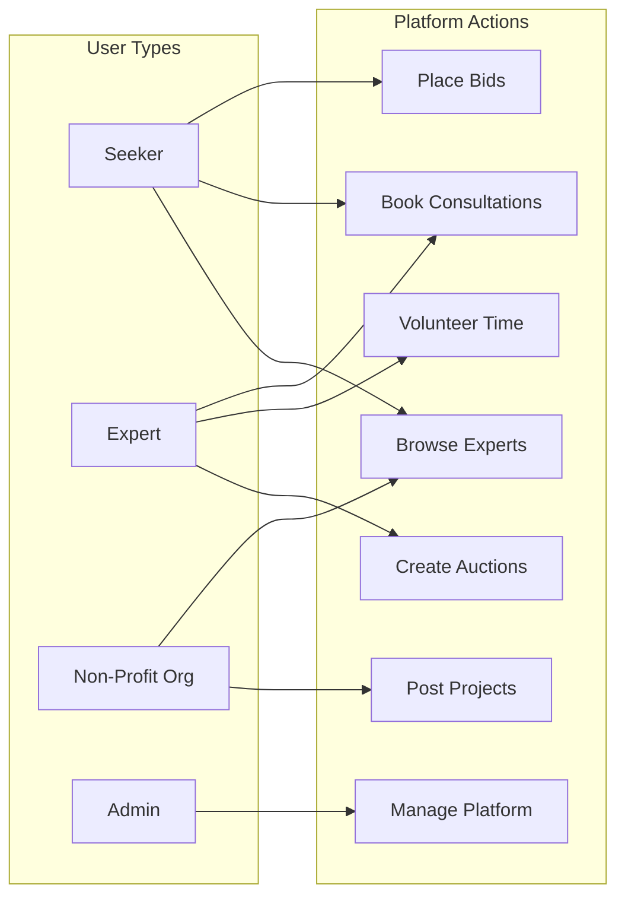
```mermaid
flowchart LR
    subgraph Users["User Types"]
        SEEKER[Seeker]
        EXPERT[Expert]
        NONPROFIT[Non-Profit Org]
        ADMIN[Admin]
    end

    subgraph Actions["Platform Actions"]
        BROWSE[Browse Experts]
        BOOK[Book Consultations]
        BID[Place Bids]
        CREATE[Create Auctions]
        VOLUNTEER[Volunteer Time]
        POST[Post Projects]
        MANAGE[Manage Platform]
    end

    SEEKER --> BROWSE
    SEEKER --> BOOK
    SEEKER --> BID

    EXPERT --> CREATE
    EXPERT --> VOLUNTEER
    EXPERT --> BOOK

    NONPROFIT --> POST
    NONPROFIT --> BROWSE

    ADMIN --> MANAGE
```

---

## 2. User Registration & Verification Flow

### 2.1 User Registration Flow

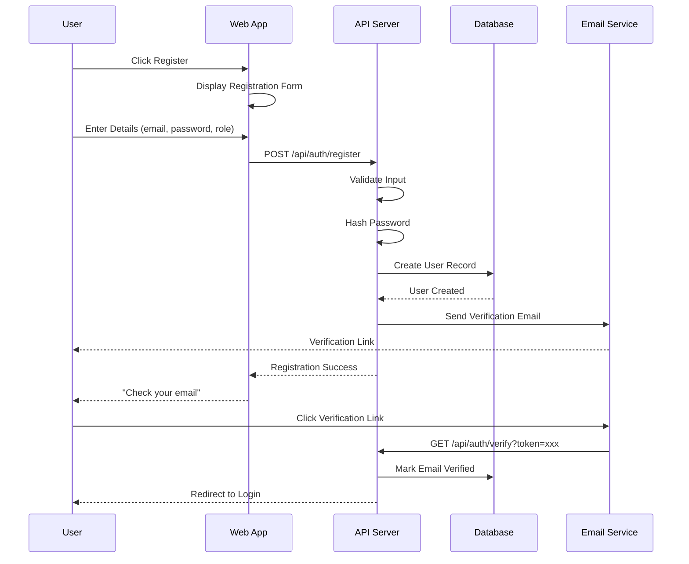
```mermaid
sequenceDiagram
    participant U as User
    participant UI as Web App
    participant API as API Server
    participant DB as Database
    participant EMAIL as Email Service

    U->>UI: Click Register
    UI->>UI: Display Registration Form
    U->>UI: Enter Details (email, password, role)
    UI->>API: POST /api/auth/register

    API->>API: Validate Input
    API->>API: Hash Password
    API->>DB: Create User Record
    DB-->>API: User Created

    API->>EMAIL: Send Verification Email
    EMAIL-->>U: Verification Link

    API-->>UI: Registration Success
    UI-->>U: "Check your email"

    U->>EMAIL: Click Verification Link
    EMAIL->>API: GET /api/auth/verify?token=xxx
    API->>DB: Mark Email Verified
    API-->>U: Redirect to Login
```

### 2.2 KYC Verification Flow

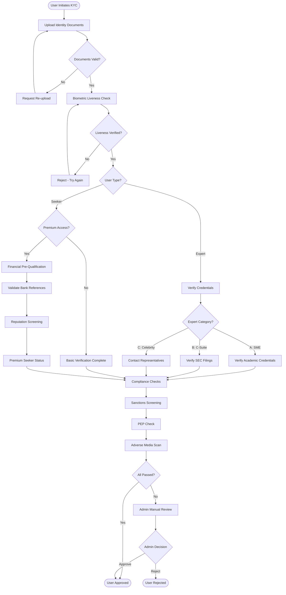
```mermaid
flowchart TD
    START([User Initiates KYC]) --> DOCS[Upload Identity Documents]
    DOCS --> VALIDATE{Documents Valid?}

    VALIDATE -->|No| REJECT1[Request Re-upload]
    REJECT1 --> DOCS

    VALIDATE -->|Yes| BIOMETRIC[Biometric Liveness Check]
    BIOMETRIC --> LIVE{Liveness Verified?}

    LIVE -->|No| REJECT2[Reject - Try Again]
    REJECT2 --> BIOMETRIC

    LIVE -->|Yes| USERTYPE{User Type?}

    USERTYPE -->|Expert| CREDENTIALS[Verify Credentials]
    USERTYPE -->|Seeker| SEEKERCHECK{Premium Access?}

    SEEKERCHECK -->|No| BASIC[Basic Verification Complete]
    SEEKERCHECK -->|Yes| FINANCIAL[Financial Pre-Qualification]

    FINANCIAL --> BANK[Validate Bank References]
    BANK --> REPUTATION[Reputation Screening]
    REPUTATION --> PREMIUM[Premium Seeker Status]

    CREDENTIALS --> CATEGORY{Expert Category?}

    CATEGORY -->|A: SME| ACADEMIC[Verify Academic Credentials]
    CATEGORY -->|B: C-Suite| SEC[Verify SEC Filings]
    CATEGORY -->|C: Celebrity| REPS[Contact Representatives]

    ACADEMIC --> COMPLIANCE
    SEC --> COMPLIANCE
    REPS --> COMPLIANCE

    BASIC --> COMPLIANCE[Compliance Checks]
    PREMIUM --> COMPLIANCE

    COMPLIANCE --> SANCTIONS[Sanctions Screening]
    SANCTIONS --> PEP[PEP Check]
    PEP --> MEDIA[Adverse Media Scan]

    MEDIA --> PASS{All Passed?}

    PASS -->|Yes| APPROVED([User Approved])
    PASS -->|No| REVIEW[Admin Manual Review]

    REVIEW --> ADMIN{Admin Decision}
    ADMIN -->|Approve| APPROVED
    ADMIN -->|Reject| REJECTED([User Rejected])
```

### 2.3 Login Flow

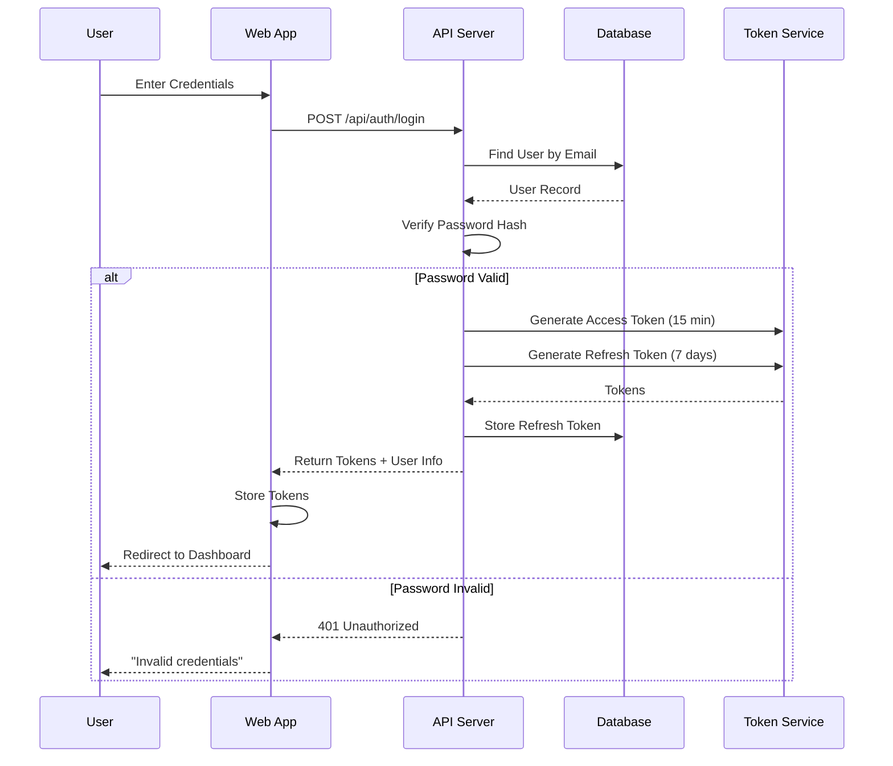
```mermaid
sequenceDiagram
    participant U as User
    participant UI as Web App
    participant API as API Server
    participant DB as Database
    participant TOKEN as Token Service

    U->>UI: Enter Credentials
    UI->>API: POST /api/auth/login

    API->>DB: Find User by Email
    DB-->>API: User Record

    API->>API: Verify Password Hash

    alt Password Valid
        API->>TOKEN: Generate Access Token (15 min)
        API->>TOKEN: Generate Refresh Token (7 days)
        TOKEN-->>API: Tokens
        API->>DB: Store Refresh Token
        API-->>UI: Return Tokens + User Info
        UI->>UI: Store Tokens
        UI-->>U: Redirect to Dashboard
    else Password Invalid
        API-->>UI: 401 Unauthorized
        UI-->>U: "Invalid credentials"
    end
```

---

## 3. Auction Flow

### 3.1 Complete Auction Lifecycle

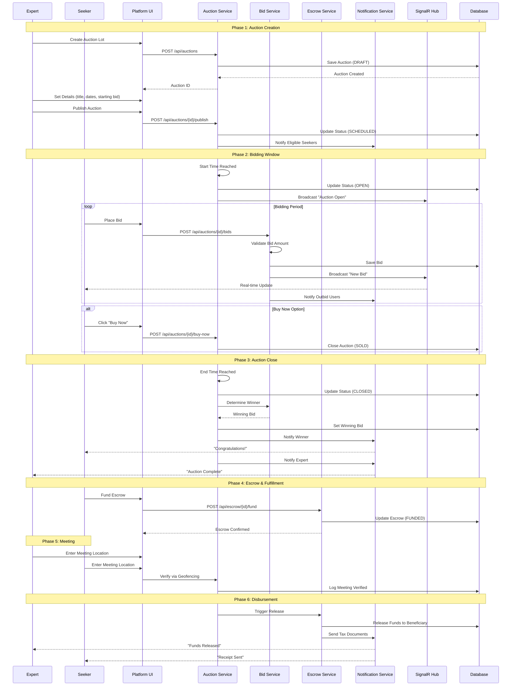
```mermaid
sequenceDiagram
    participant EX as Expert
    participant SK as Seeker
    participant UI as Platform UI
    participant AUC as Auction Service
    participant BID as Bid Service
    participant ESC as Escrow Service
    participant NOTIF as Notification Service
    participant HUB as SignalR Hub
    participant DB as Database

    Note over EX,DB: Phase 1: Auction Creation
    EX->>UI: Create Auction Lot
    UI->>AUC: POST /api/auctions
    AUC->>DB: Save Auction (DRAFT)
    DB-->>AUC: Auction Created
    AUC-->>UI: Auction ID

    EX->>UI: Set Details (title, dates, starting bid)
    EX->>UI: Publish Auction
    UI->>AUC: POST /api/auctions/{id}/publish
    AUC->>DB: Update Status (SCHEDULED)
    AUC->>NOTIF: Notify Eligible Seekers

    Note over EX,DB: Phase 2: Bidding Window
    AUC->>AUC: Start Time Reached
    AUC->>DB: Update Status (OPEN)
    AUC->>HUB: Broadcast "Auction Open"

    loop Bidding Period
        SK->>UI: Place Bid
        UI->>BID: POST /api/auctions/{id}/bids
        BID->>BID: Validate Bid Amount
        BID->>DB: Save Bid
        BID->>HUB: Broadcast "New Bid"
        HUB-->>SK: Real-time Update
        BID->>NOTIF: Notify Outbid Users
    end

    alt Buy Now Option
        SK->>UI: Click "Buy Now"
        UI->>AUC: POST /api/auctions/{id}/buy-now
        AUC->>DB: Close Auction (SOLD)
    end

    Note over EX,DB: Phase 3: Auction Close
    AUC->>AUC: End Time Reached
    AUC->>DB: Update Status (CLOSED)
    AUC->>BID: Determine Winner
    BID-->>AUC: Winning Bid
    AUC->>DB: Set Winning Bid
    AUC->>NOTIF: Notify Winner
    NOTIF-->>SK: "Congratulations!"
    AUC->>NOTIF: Notify Expert
    NOTIF-->>EX: "Auction Complete"

    Note over EX,DB: Phase 4: Escrow & Fulfillment
    SK->>UI: Fund Escrow
    UI->>ESC: POST /api/escrow/{id}/fund
    ESC->>DB: Update Escrow (FUNDED)
    ESC-->>UI: Escrow Confirmed

    Note over EX,SK: Phase 5: Meeting
    EX->>UI: Enter Meeting Location
    SK->>UI: Enter Meeting Location
    UI->>AUC: Verify via Geofencing
    AUC->>DB: Log Meeting Verified

    Note over EX,DB: Phase 6: Disbursement
    AUC->>ESC: Trigger Release
    ESC->>DB: Release Funds to Beneficiary
    ESC->>NOTIF: Send Tax Documents
    NOTIF-->>EX: "Funds Released"
    NOTIF-->>SK: "Receipt Sent"
```

### 3.2 Bidding Decision Flow

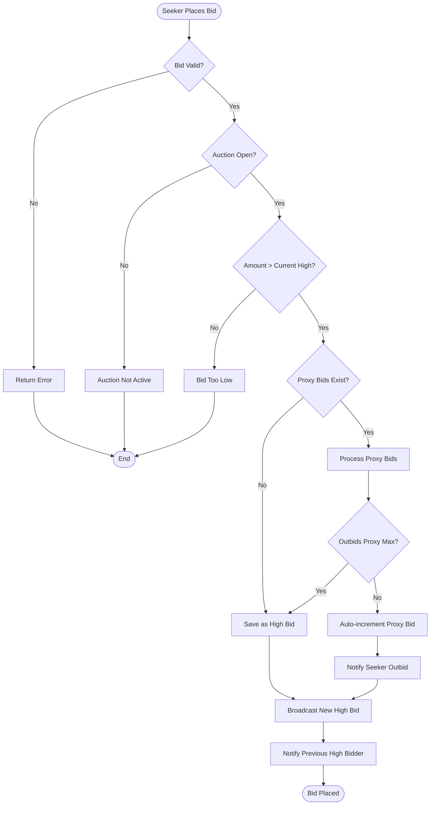
```mermaid
flowchart TD
    START([Seeker Places Bid]) --> VALIDATE{Bid Valid?}

    VALIDATE -->|No| ERROR[Return Error]
    ERROR --> END1([End])

    VALIDATE -->|Yes| CHECK_AUCTION{Auction Open?}

    CHECK_AUCTION -->|No| ERROR2[Auction Not Active]
    ERROR2 --> END1

    CHECK_AUCTION -->|Yes| CHECK_AMOUNT{Amount > Current High?}

    CHECK_AMOUNT -->|No| ERROR3[Bid Too Low]
    ERROR3 --> END1

    CHECK_AMOUNT -->|Yes| CHECK_PROXY{Proxy Bids Exist?}

    CHECK_PROXY -->|No| SAVE[Save as High Bid]

    CHECK_PROXY -->|Yes| PROCESS_PROXY[Process Proxy Bids]
    PROCESS_PROXY --> OUTBID{Outbids Proxy Max?}

    OUTBID -->|Yes| SAVE
    OUTBID -->|No| AUTO_BID[Auto-increment Proxy Bid]
    AUTO_BID --> NOTIFY_SEEKER[Notify Seeker Outbid]

    SAVE --> NOTIFY_ALL[Broadcast New High Bid]
    NOTIFY_SEEKER --> NOTIFY_ALL

    NOTIFY_ALL --> NOTIFY_PREV[Notify Previous High Bidder]
    NOTIFY_PREV --> END2([Bid Placed])
```

---

## 4. Consultation Booking Flow

### 4.1 End-to-End Consultation Flow

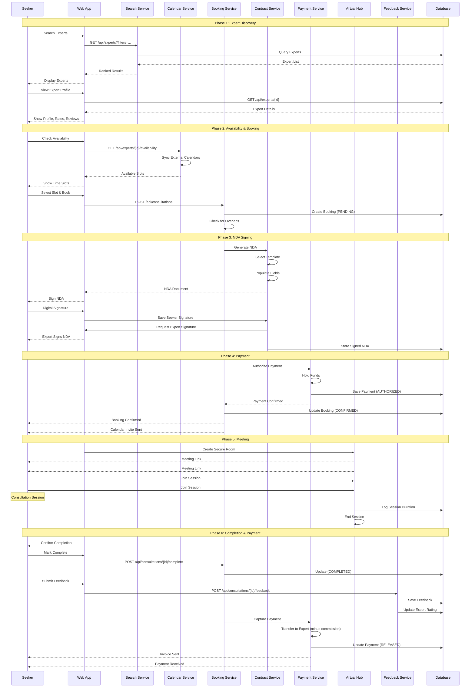
```mermaid
sequenceDiagram
    participant SK as Seeker
    participant UI as Web App
    participant SEARCH as Search Service
    participant CAL as Calendar Service
    participant BOOK as Booking Service
    participant NDA as Contract Service
    participant PAY as Payment Service
    participant HUB as Virtual Hub
    participant FEED as Feedback Service
    participant DB as Database

    Note over SK,DB: Phase 1: Expert Discovery
    SK->>UI: Search Experts
    UI->>SEARCH: GET /api/experts?filters=...
    SEARCH->>DB: Query Experts
    DB-->>SEARCH: Expert List
    SEARCH-->>UI: Ranked Results
    UI-->>SK: Display Experts

    SK->>UI: View Expert Profile
    UI->>DB: GET /api/experts/{id}
    DB-->>UI: Expert Details
    UI-->>SK: Show Profile, Rates, Reviews

    Note over SK,DB: Phase 2: Availability & Booking
    SK->>UI: Check Availability
    UI->>CAL: GET /api/experts/{id}/availability
    CAL->>CAL: Sync External Calendars
    CAL-->>UI: Available Slots
    UI-->>SK: Show Time Slots

    SK->>UI: Select Slot & Book
    UI->>BOOK: POST /api/consultations
    BOOK->>DB: Create Booking (PENDING)
    BOOK->>BOOK: Check for Overlaps

    Note over SK,DB: Phase 3: NDA Signing
    BOOK->>NDA: Generate NDA
    NDA->>NDA: Select Template
    NDA->>NDA: Populate Fields
    NDA-->>UI: NDA Document

    UI-->>SK: Sign NDA
    SK->>UI: Digital Signature
    UI->>NDA: Save Seeker Signature

    NDA->>UI: Request Expert Signature
    UI-->>SK: Expert Signs NDA
    NDA->>DB: Store Signed NDA

    Note over SK,DB: Phase 4: Payment
    BOOK->>PAY: Authorize Payment
    PAY->>PAY: Hold Funds
    PAY->>DB: Save Payment (AUTHORIZED)
    PAY-->>BOOK: Payment Confirmed

    BOOK->>DB: Update Booking (CONFIRMED)
    BOOK-->>SK: Booking Confirmed
    BOOK-->>SK: Calendar Invite Sent

    Note over SK,DB: Phase 5: Meeting
    UI->>HUB: Create Secure Room
    HUB-->>SK: Meeting Link
    HUB-->>SK: Meeting Link

    SK->>HUB: Join Session
    SK->>HUB: Join Session

    Note over SK,SK: Consultation Session

    HUB->>DB: Log Session Duration
    HUB->>HUB: End Session

    Note over SK,DB: Phase 6: Completion & Payment
    UI-->>SK: Confirm Completion
    SK->>UI: Mark Complete
    UI->>BOOK: POST /api/consultations/{id}/complete
    BOOK->>DB: Update (COMPLETED)

    SK->>UI: Submit Feedback
    UI->>FEED: POST /api/consultations/{id}/feedback
    FEED->>DB: Save Feedback
    FEED->>DB: Update Expert Rating

    BOOK->>PAY: Capture Payment
    PAY->>PAY: Transfer to Expert (minus commission)
    PAY->>DB: Update Payment (RELEASED)
    PAY-->>SK: Invoice Sent
    PAY-->>SK: Payment Received
```

### 4.2 Booking Decision Flow

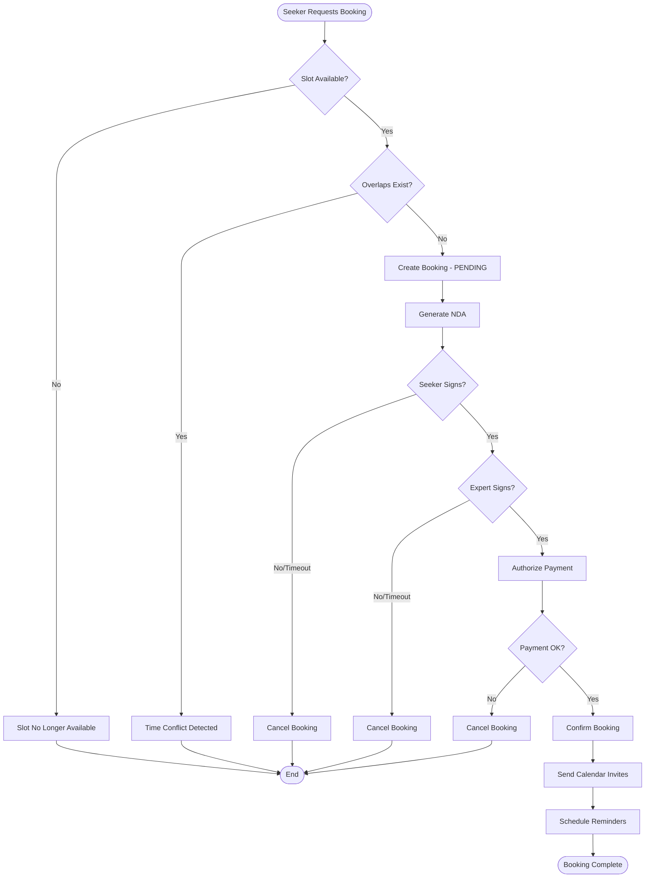
```mermaid
flowchart TD
    START([Seeker Requests Booking]) --> CHECK_SLOT{Slot Available?}

    CHECK_SLOT -->|No| ERROR1[Slot No Longer Available]
    ERROR1 --> END1([End])

    CHECK_SLOT -->|Yes| CHECK_OVERLAP{Overlaps Exist?}

    CHECK_OVERLAP -->|Yes| ERROR2[Time Conflict Detected]
    ERROR2 --> END1

    CHECK_OVERLAP -->|No| CREATE[Create Booking - PENDING]
    CREATE --> GEN_NDA[Generate NDA]

    GEN_NDA --> SEEKER_SIGN{Seeker Signs?}

    SEEKER_SIGN -->|No/Timeout| CANCEL1[Cancel Booking]
    CANCEL1 --> END1

    SEEKER_SIGN -->|Yes| EXPERT_SIGN{Expert Signs?}

    EXPERT_SIGN -->|No/Timeout| CANCEL2[Cancel Booking]
    CANCEL2 --> END1

    EXPERT_SIGN -->|Yes| AUTHORIZE[Authorize Payment]

    AUTHORIZE --> PAY_SUCCESS{Payment OK?}

    PAY_SUCCESS -->|No| CANCEL3[Cancel Booking]
    CANCEL3 --> END1

    PAY_SUCCESS -->|Yes| CONFIRM[Confirm Booking]
    CONFIRM --> CALENDAR[Send Calendar Invites]
    CALENDAR --> REMINDER[Schedule Reminders]
    REMINDER --> END2([Booking Complete])
```

---

## 5. Pro-Bono Project Flow

### 5.1 Complete Project Lifecycle

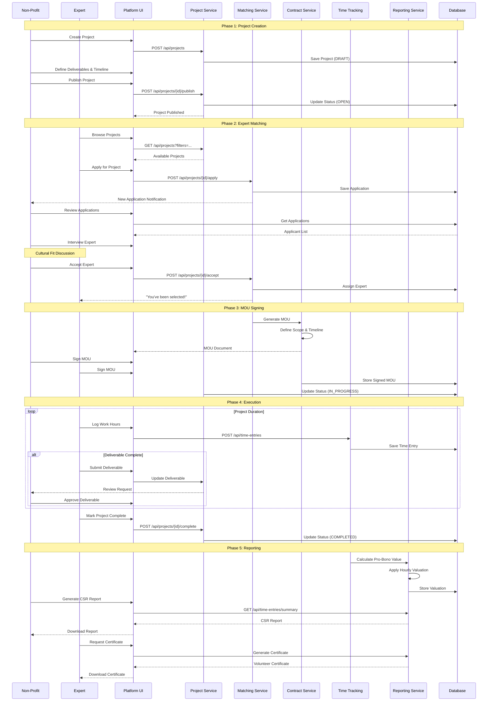
```mermaid
sequenceDiagram
    participant NP as Non-Profit
    participant EX as Expert
    participant UI as Platform UI
    participant PROJ as Project Service
    participant MATCH as Matching Service
    participant MOU as Contract Service
    participant TIME as Time Tracking
    participant RPT as Reporting Service
    participant DB as Database

    Note over NP,DB: Phase 1: Project Creation
    NP->>UI: Create Project
    UI->>PROJ: POST /api/projects
    PROJ->>DB: Save Project (DRAFT)

    NP->>UI: Define Deliverables & Timeline
    NP->>UI: Publish Project
    UI->>PROJ: POST /api/projects/{id}/publish
    PROJ->>DB: Update Status (OPEN)
    PROJ-->>UI: Project Published

    Note over NP,DB: Phase 2: Expert Matching
    EX->>UI: Browse Projects
    UI->>PROJ: GET /api/projects?filters=...
    PROJ-->>UI: Available Projects

    EX->>UI: Apply for Project
    UI->>MATCH: POST /api/projects/{id}/apply
    MATCH->>DB: Save Application
    MATCH-->>NP: New Application Notification

    NP->>UI: Review Applications
    UI->>DB: Get Applications
    DB-->>UI: Applicant List

    NP->>UI: Interview Expert
    Note over NP,EX: Cultural Fit Discussion

    NP->>UI: Accept Expert
    UI->>MATCH: POST /api/projects/{id}/accept
    MATCH->>DB: Assign Expert
    MATCH-->>EX: "You've been selected!"

    Note over NP,DB: Phase 3: MOU Signing
    MATCH->>MOU: Generate MOU
    MOU->>MOU: Define Scope & Timeline
    MOU-->>UI: MOU Document

    NP->>UI: Sign MOU
    EX->>UI: Sign MOU
    MOU->>DB: Store Signed MOU

    PROJ->>DB: Update Status (IN_PROGRESS)

    Note over NP,DB: Phase 4: Execution
    loop Project Duration
        EX->>UI: Log Work Hours
        UI->>TIME: POST /api/time-entries
        TIME->>DB: Save Time Entry

        alt Deliverable Complete
            EX->>UI: Submit Deliverable
            UI->>PROJ: Update Deliverable
            PROJ-->>NP: Review Request
            NP->>UI: Approve Deliverable
        end
    end

    EX->>UI: Mark Project Complete
    UI->>PROJ: POST /api/projects/{id}/complete
    PROJ->>DB: Update Status (COMPLETED)

    Note over NP,DB: Phase 5: Reporting
    TIME->>RPT: Calculate Pro-Bono Value
    RPT->>RPT: Apply Hourly Valuation
    RPT->>DB: Store Valuation

    NP->>UI: Generate CSR Report
    UI->>RPT: GET /api/time-entries/summary
    RPT-->>UI: CSR Report
    UI-->>NP: Download Report

    EX->>UI: Request Certificate
    UI->>RPT: Generate Certificate
    RPT-->>UI: Volunteer Certificate
    UI-->>EX: Download Certificate
```

### 5.2 Project Matching Flow

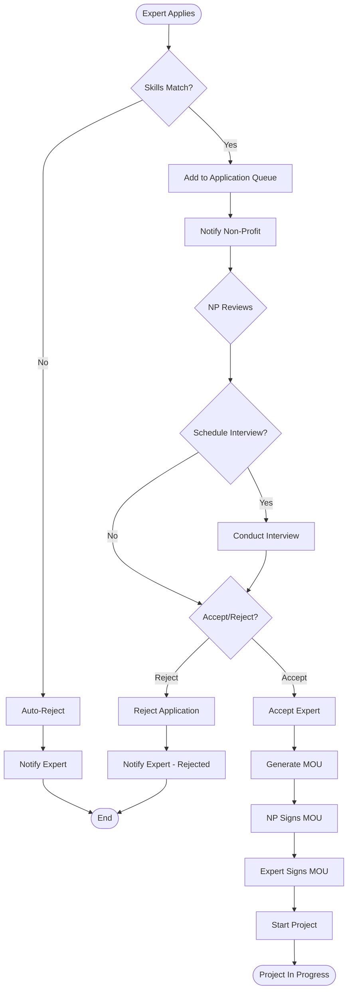
```mermaid
flowchart TD
    START([Expert Applies]) --> CHECK_SKILLS{Skills Match?}

    CHECK_SKILLS -->|No| REJECT1[Auto-Reject]
    REJECT1 --> NOTIFY_EX1[Notify Expert]
    NOTIFY_EX1 --> END1([End])

    CHECK_SKILLS -->|Yes| QUEUE[Add to Application Queue]
    QUEUE --> NOTIFY_NP[Notify Non-Profit]

    NOTIFY_NP --> REVIEW{NP Reviews}

    REVIEW --> INTERVIEW{Schedule Interview?}

    INTERVIEW -->|No| DECISION{Accept/Reject?}
    INTERVIEW -->|Yes| CONDUCT[Conduct Interview]
    CONDUCT --> DECISION

    DECISION -->|Reject| REJECT2[Reject Application]
    REJECT2 --> NOTIFY_EX2[Notify Expert - Rejected]
    NOTIFY_EX2 --> END1

    DECISION -->|Accept| ACCEPT[Accept Expert]
    ACCEPT --> GENERATE[Generate MOU]
    GENERATE --> SIGN_NP[NP Signs MOU]
    SIGN_NP --> SIGN_EX[Expert Signs MOU]
    SIGN_EX --> START_PROJECT[Start Project]
    START_PROJECT --> END2([Project In Progress])
```

---

## 6. Payment & Escrow Flow

### 6.1 Payment Processing Flow

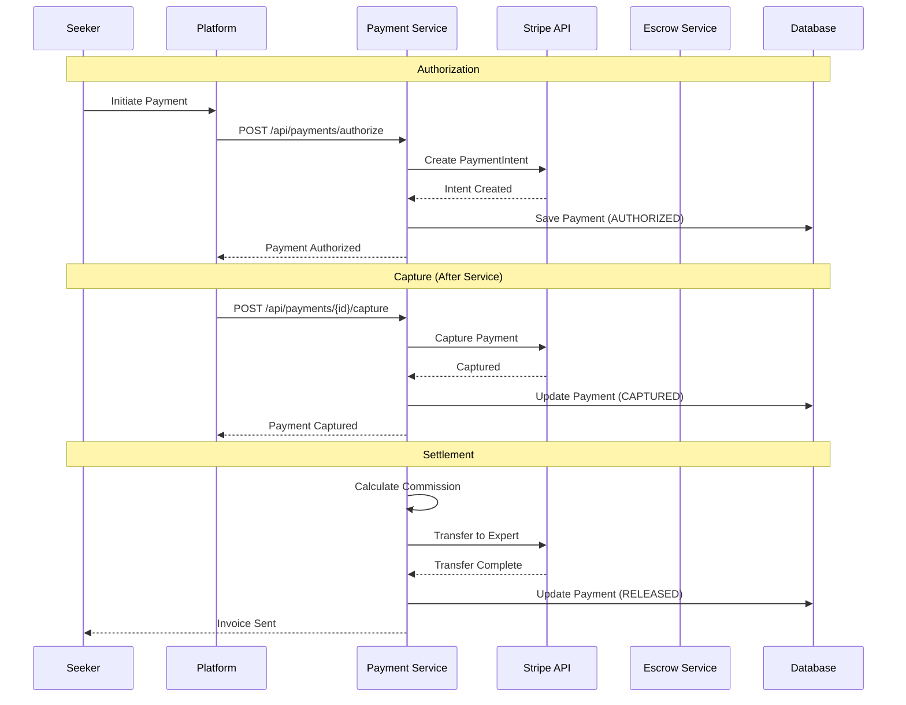
```mermaid
sequenceDiagram
    participant SK as Seeker
    participant UI as Platform
    participant PAY as Payment Service
    participant STRIPE as Stripe API
    participant ESC as Escrow Service
    participant DB as Database

    Note over SK,DB: Authorization
    SK->>UI: Initiate Payment
    UI->>PAY: POST /api/payments/authorize
    PAY->>STRIPE: Create PaymentIntent
    STRIPE-->>PAY: Intent Created
    PAY->>DB: Save Payment (AUTHORIZED)
    PAY-->>UI: Payment Authorized

    Note over SK,DB: Capture (After Service)
    UI->>PAY: POST /api/payments/{id}/capture
    PAY->>STRIPE: Capture Payment
    STRIPE-->>PAY: Captured
    PAY->>DB: Update Payment (CAPTURED)
    PAY-->>UI: Payment Captured

    Note over SK,DB: Settlement
    PAY->>PAY: Calculate Commission
    PAY->>STRIPE: Transfer to Expert
    STRIPE-->>PAY: Transfer Complete
    PAY->>DB: Update Payment (RELEASED)
    PAY-->>SK: Invoice Sent
```

### 6.2 Escrow Flow with Milestones

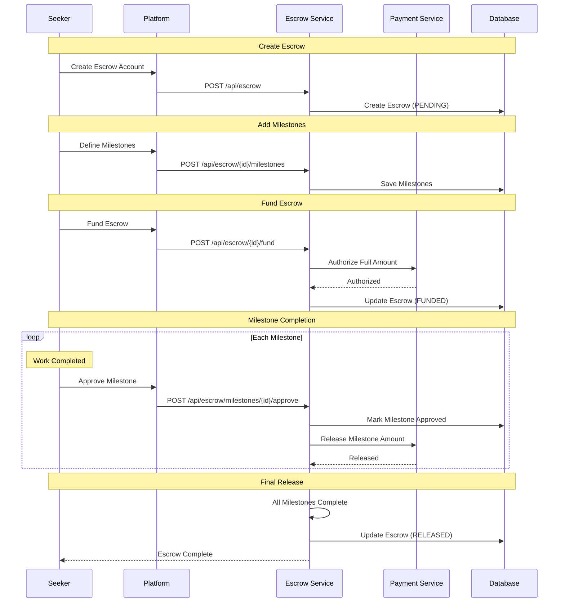
```mermaid
sequenceDiagram
    participant SK as Seeker
    participant UI as Platform
    participant ESC as Escrow Service
    participant PAY as Payment Service
    participant DB as Database

    Note over SK,DB: Create Escrow
    SK->>UI: Create Escrow Account
    UI->>ESC: POST /api/escrow
    ESC->>DB: Create Escrow (PENDING)

    Note over SK,DB: Add Milestones
    SK->>UI: Define Milestones
    UI->>ESC: POST /api/escrow/{id}/milestones
    ESC->>DB: Save Milestones

    Note over SK,DB: Fund Escrow
    SK->>UI: Fund Escrow
    UI->>ESC: POST /api/escrow/{id}/fund
    ESC->>PAY: Authorize Full Amount
    PAY-->>ESC: Authorized
    ESC->>DB: Update Escrow (FUNDED)

    Note over SK,DB: Milestone Completion
    loop Each Milestone
        Note over SK,SK: Work Completed
        SK->>UI: Approve Milestone
        UI->>ESC: POST /api/escrow/milestones/{id}/approve
        ESC->>DB: Mark Milestone Approved
        ESC->>PAY: Release Milestone Amount
        PAY-->>ESC: Released
    end

    Note over SK,DB: Final Release
    ESC->>ESC: All Milestones Complete
    ESC->>DB: Update Escrow (RELEASED)
    ESC-->>SK: Escrow Complete
```

### 6.3 Escrow State Flow

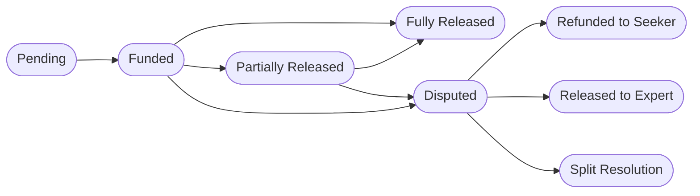
```mermaid
flowchart LR
    PENDING([Pending]) --> FUNDED([Funded])
    FUNDED --> PARTIAL([Partially Released])
    PARTIAL --> RELEASED([Fully Released])
    FUNDED --> RELEASED

    FUNDED --> DISPUTED([Disputed])
    PARTIAL --> DISPUTED

    DISPUTED --> RESOLVED_SEEKER([Refunded to Seeker])
    DISPUTED --> RESOLVED_EXPERT([Released to Expert])
    DISPUTED --> RESOLVED_SPLIT([Split Resolution])
```

---

## 7. Real-Time Bidding Flow

### 7.1 SignalR Connection Flow

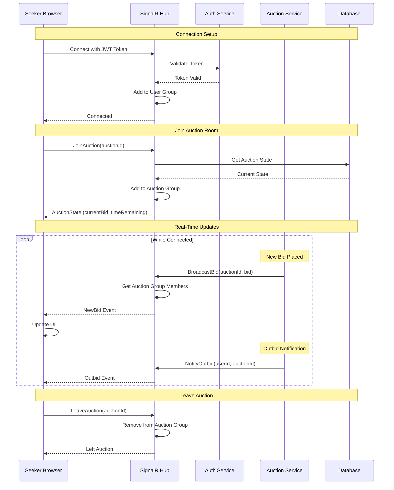
```mermaid
sequenceDiagram
    participant SK as Seeker Browser
    participant HUB as SignalR Hub
    participant AUTH as Auth Service
    participant AUC as Auction Service
    participant DB as Database

    Note over SK,DB: Connection Setup
    SK->>HUB: Connect with JWT Token
    HUB->>AUTH: Validate Token
    AUTH-->>HUB: Token Valid
    HUB->>HUB: Add to User Group
    HUB-->>SK: Connected

    Note over SK,DB: Join Auction Room
    SK->>HUB: JoinAuction(auctionId)
    HUB->>DB: Get Auction State
    DB-->>HUB: Current State
    HUB->>HUB: Add to Auction Group
    HUB-->>SK: AuctionState (currentBid, timeRemaining)

    Note over SK,DB: Real-Time Updates
    loop While Connected
        Note over AUC: New Bid Placed
        AUC->>HUB: BroadcastBid(auctionId, bid)
        HUB->>HUB: Get Auction Group Members
        HUB-->>SK: NewBid Event
        SK->>SK: Update UI

        Note over AUC: Outbid Notification
        AUC->>HUB: NotifyOutbid(userId, auctionId)
        HUB-->>SK: Outbid Event
    end

    Note over SK,DB: Leave Auction
    SK->>HUB: LeaveAuction(auctionId)
    HUB->>HUB: Remove from Auction Group
    HUB-->>SK: Left Auction
```

### 7.2 Bid Broadcast Flow

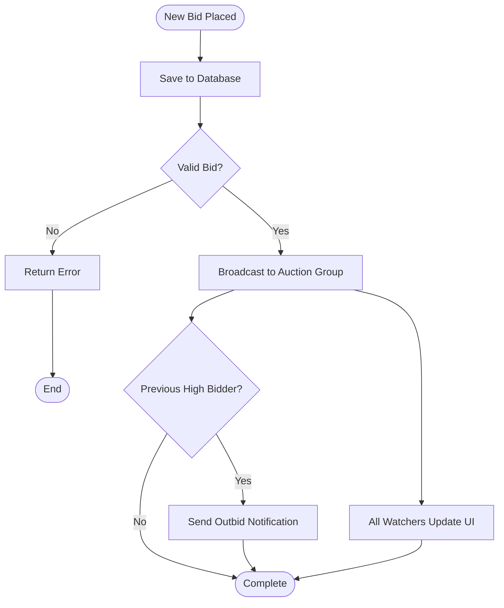
```mermaid
flowchart TD
    BID([New Bid Placed]) --> SAVE[Save to Database]
    SAVE --> VALIDATE{Valid Bid?}

    VALIDATE -->|No| ERROR[Return Error]
    ERROR --> END1([End])

    VALIDATE -->|Yes| BROADCAST[Broadcast to Auction Group]

    BROADCAST --> UPDATE_UI[All Watchers Update UI]

    BROADCAST --> CHECK_OUTBID{Previous High Bidder?}

    CHECK_OUTBID -->|Yes| NOTIFY_OUTBID[Send Outbid Notification]
    CHECK_OUTBID -->|No| END2

    NOTIFY_OUTBID --> END2([Complete])
    UPDATE_UI --> END2
```

---

## 8. State Diagrams

### 8.1 Auction Status States

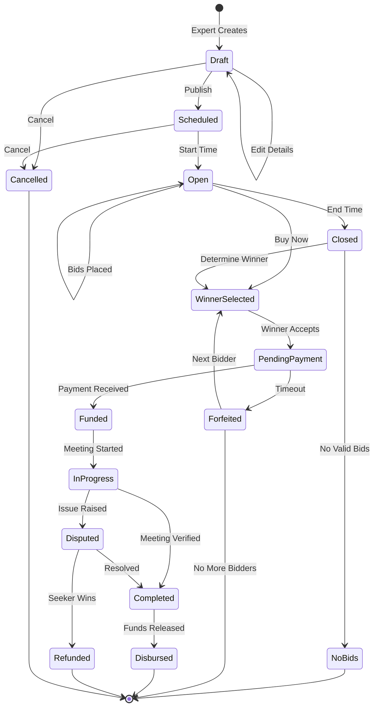
```mermaid
stateDiagram-v2
    [*] --> Draft: Expert Creates

    Draft --> Draft: Edit Details
    Draft --> Scheduled: Publish
    Draft --> Cancelled: Cancel

    Scheduled --> Open: Start Time
    Scheduled --> Cancelled: Cancel

    Open --> Open: Bids Placed
    Open --> Closed: End Time
    Open --> WinnerSelected: Buy Now

    Closed --> WinnerSelected: Determine Winner
    Closed --> NoBids: No Valid Bids

    NoBids --> [*]

    WinnerSelected --> PendingPayment: Winner Accepts

    PendingPayment --> Funded: Payment Received
    PendingPayment --> Forfeited: Timeout

    Forfeited --> WinnerSelected: Next Bidder
    Forfeited --> [*]: No More Bidders

    Funded --> InProgress: Meeting Started

    InProgress --> Completed: Meeting Verified
    InProgress --> Disputed: Issue Raised

    Completed --> Disbursed: Funds Released

    Disputed --> Completed: Resolved
    Disputed --> Refunded: Seeker Wins

    Disbursed --> [*]
    Refunded --> [*]
    Cancelled --> [*]
```

### 8.2 Consultation Status States

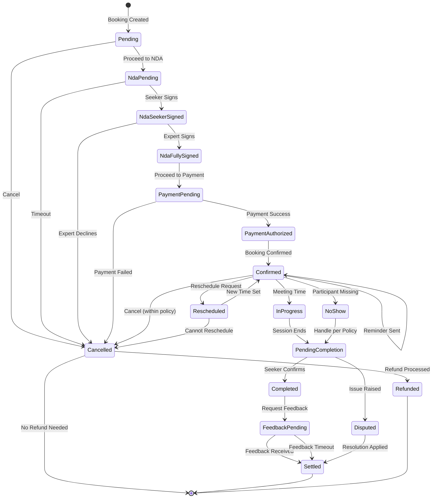
```mermaid
stateDiagram-v2
    [*] --> Pending: Booking Created

    Pending --> NdaPending: Proceed to NDA
    Pending --> Cancelled: Cancel

    NdaPending --> NdaSeekerSigned: Seeker Signs
    NdaPending --> Cancelled: Timeout

    NdaSeekerSigned --> NdaFullySigned: Expert Signs
    NdaSeekerSigned --> Cancelled: Expert Declines

    NdaFullySigned --> PaymentPending: Proceed to Payment

    PaymentPending --> PaymentAuthorized: Payment Success
    PaymentPending --> Cancelled: Payment Failed

    PaymentAuthorized --> Confirmed: Booking Confirmed

    Confirmed --> Confirmed: Reminder Sent
    Confirmed --> Rescheduled: Reschedule Request
    Confirmed --> InProgress: Meeting Time
    Confirmed --> Cancelled: Cancel (within policy)
    Confirmed --> NoShow: Participant Missing

    Rescheduled --> Confirmed: New Time Set
    Rescheduled --> Cancelled: Cannot Reschedule

    InProgress --> PendingCompletion: Session Ends

    NoShow --> PendingCompletion: Handle per Policy

    PendingCompletion --> Completed: Seeker Confirms
    PendingCompletion --> Disputed: Issue Raised

    Completed --> FeedbackPending: Request Feedback

    FeedbackPending --> Settled: Feedback Received
    FeedbackPending --> Settled: Feedback Timeout

    Disputed --> Settled: Resolution Applied

    Cancelled --> Refunded: Refund Processed
    Cancelled --> [*]: No Refund Needed

    Settled --> [*]
    Refunded --> [*]
```

### 8.3 Pro-Bono Project States

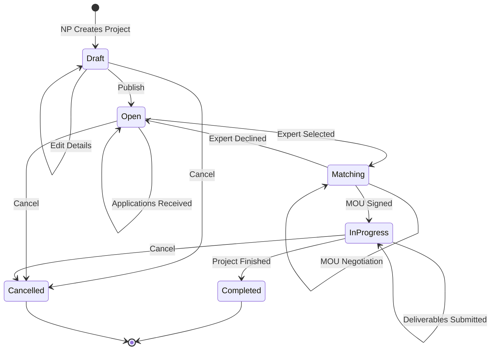
```mermaid
stateDiagram-v2
    [*] --> Draft: NP Creates Project

    Draft --> Draft: Edit Details
    Draft --> Open: Publish
    Draft --> Cancelled: Cancel

    Open --> Open: Applications Received
    Open --> Matching: Expert Selected
    Open --> Cancelled: Cancel

    Matching --> Matching: MOU Negotiation
    Matching --> InProgress: MOU Signed
    Matching --> Open: Expert Declined

    InProgress --> InProgress: Time Logged
    InProgress --> InProgress: Deliverables Submitted
    InProgress --> Completed: Project Finished
    InProgress --> Cancelled: Cancel

    Completed --> [*]
    Cancelled --> [*]
```

---

## 9. Component Architecture

### 9.1 Backend Component Diagram

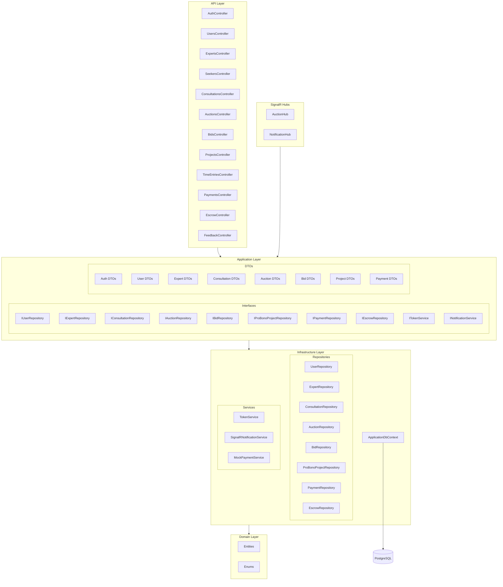
```mermaid
flowchart TB
    subgraph API["API Layer"]
        AUTH_CTRL[AuthController]
        USER_CTRL[UsersController]
        EXPERT_CTRL[ExpertsController]
        SEEKER_CTRL[SeekersController]
        CONSULT_CTRL[ConsultationsController]
        AUCTION_CTRL[AuctionsController]
        BID_CTRL[BidsController]
        PROJECT_CTRL[ProjectsController]
        TIME_CTRL[TimeEntriesController]
        PAY_CTRL[PaymentsController]
        ESCROW_CTRL[EscrowController]
        FEEDBACK_CTRL[FeedbackController]
    end

    subgraph HUBS["SignalR Hubs"]
        AUC_HUB[AuctionHub]
        NOTIF_HUB[NotificationHub]
    end

    subgraph APP["Application Layer"]
        subgraph INTERFACES["Interfaces"]
            I_USER[IUserRepository]
            I_EXPERT[IExpertRepository]
            I_CONSULT[IConsultationRepository]
            I_AUCTION[IAuctionRepository]
            I_BID[IBidRepository]
            I_PROJECT[IProBonoProjectRepository]
            I_PAY[IPaymentRepository]
            I_ESC[IEscrowRepository]
            I_TOKEN[ITokenService]
            I_NOTIF[INotificationService]
        end

        subgraph DTOS["DTOs"]
            AUTH_DTO[Auth DTOs]
            USER_DTO[User DTOs]
            EXPERT_DTO[Expert DTOs]
            CONSULT_DTO[Consultation DTOs]
            AUCTION_DTO[Auction DTOs]
            BID_DTO[Bid DTOs]
            PROJECT_DTO[Project DTOs]
            PAY_DTO[Payment DTOs]
        end
    end

    subgraph INFRA["Infrastructure Layer"]
        subgraph REPOS["Repositories"]
            USER_REPO[UserRepository]
            EXPERT_REPO[ExpertRepository]
            CONSULT_REPO[ConsultationRepository]
            AUCTION_REPO[AuctionRepository]
            BID_REPO[BidRepository]
            PROJECT_REPO[ProBonoProjectRepository]
            PAY_REPO[PaymentRepository]
            ESC_REPO[EscrowRepository]
        end

        subgraph SERVICES["Services"]
            TOKEN_SVC[TokenService]
            NOTIF_SVC[SignalRNotificationService]
            PAY_SVC[MockPaymentService]
        end

        DB_CTX[ApplicationDbContext]
    end

    subgraph DOMAIN["Domain Layer"]
        ENTITIES[Entities]
        ENUMS[Enums]
    end

    API --> APP
    HUBS --> APP
    APP --> INFRA
    INFRA --> DOMAIN
    DB_CTX --> PG[(PostgreSQL)]
```

### 9.2 Frontend Component Structure

```mermaid
flowchart TB
    subgraph PAGES["Pages (App Router)"]
        AUTH_PAGES["(auth)/<br/>login, register"]
        DASH_PAGES["(dashboard)/<br/>dashboard, profile"]
        EXPERT_PAGES["experts/<br/>[id], search"]
        CONSULT_PAGES["consultations/<br/>[id], book"]
        AUCTION_PAGES["auctions/<br/>[id], create"]
        PROJECT_PAGES["projects/<br/>[id], create"]
        ADMIN_PAGES["admin/<br/>users, reports"]
    end

    subgraph COMPONENTS["Components"]
        LAYOUT[Layout Components<br/>Navbar, Footer, Sidebar]
        UI[UI Components<br/>Button, Input, Modal, Card]
        FORMS[Form Components<br/>LoginForm, BookingForm]
        BUSINESS[Business Components<br/>ExpertCard, AuctionCard, BidList]
    end

    subgraph HOOKS["Hooks"]
        USE_AUTH[useAuth]
        USE_API[useApi]
        USE_SIGNALR[useSignalR]
    end

    subgraph STORES["State Management"]
        AUTH_STORE[Auth Store]
        AUCTION_STORE[Auction Store]
        NOTIFICATION_STORE[Notification Store]
    end

    subgraph LIB["Library"]
        API_CLIENT[API Client]
        SIGNALR_CLIENT[SignalR Client]
        VALIDATORS[Validators]
    end

    PAGES --> COMPONENTS
    PAGES --> HOOKS
    HOOKS --> STORES
    HOOKS --> LIB
    LIB --> BACKEND[Backend API]
```

---

## 10. Entity Relationship Diagram

### 10.1 Core Entity Relationships

```mermaid
erDiagram
    USERS ||--o| EXPERTS : "has"
    USERS ||--o| SEEKERS : "has"
    USERS ||--o| NON_PROFIT_ORGS : "has"

    EXPERTS ||--o{ CREDENTIALS : "has"
    EXPERTS ||--o{ EXPERT_AVAILABILITIES : "has"
    EXPERTS ||--o{ AUCTION_LOTS : "creates"
    EXPERTS ||--o{ CONSULTATIONS : "provides"
    EXPERTS ||--o{ PROBONO_PROJECTS : "volunteers"
    EXPERTS ||--o{ TIME_ENTRIES : "logs"

    SEEKERS ||--o{ BIDS : "places"
    SEEKERS ||--o{ CONSULTATIONS : "books"
    SEEKERS ||--o{ FEEDBACK : "gives"

    NON_PROFIT_ORGS ||--o{ PROBONO_PROJECTS : "creates"
    NON_PROFIT_ORGS ||--o{ AUCTION_LOTS : "benefits"

    AUCTION_LOTS ||--o{ BIDS : "receives"
    AUCTION_LOTS ||--o| PHYSICAL_MEETINGS : "has"

    CONSULTATIONS ||--|| NDAS : "requires"
    CONSULTATIONS ||--|| PAYMENTS : "has"
    CONSULTATIONS ||--o| PHYSICAL_MEETINGS : "may have"
    CONSULTATIONS ||--o| FEEDBACK : "receives"

    PROBONO_PROJECTS ||--|| MOUS : "requires"
    PROBONO_PROJECTS ||--o{ TIME_ENTRIES : "tracks"

    PAYMENTS ||--o| ESCROW_ACCOUNTS : "may have"
    ESCROW_ACCOUNTS ||--o{ MILESTONES : "has"

    VENUES ||--o{ PHYSICAL_MEETINGS : "hosts"
    VENUES ||--|| GEOFENCES : "defines"
    GEOFENCES ||--o{ GEOFENCE_EVENTS : "logs"

    PHYSICAL_MEETINGS ||--o{ GUESTS : "includes"

    USERS {
        uuid id PK
        string email
        string user_type
        string verification_status
        timestamp created_at
    }

    EXPERTS {
        uuid id PK
        uuid user_id FK
        string category
        decimal hourly_rate
        text bio
    }

    SEEKERS {
        uuid id PK
        uuid user_id FK
        string kyc_status
        boolean bid_eligible
    }

    AUCTION_LOTS {
        uuid id PK
        uuid expert_id FK
        string title
        decimal starting_bid
        decimal buy_now_price
        string status
    }

    BIDS {
        uuid id PK
        uuid auction_id FK
        uuid seeker_id FK
        decimal amount
        boolean is_proxy
    }

    CONSULTATIONS {
        uuid id PK
        uuid expert_id FK
        uuid seeker_id FK
        timestamp scheduled_at
        decimal rate
        string status
    }

    PROBONO_PROJECTS {
        uuid id PK
        uuid org_id FK
        uuid expert_id FK
        string title
        string status
    }

    PAYMENTS {
        uuid id PK
        decimal amount
        string status
        string stripe_id
    }

    ESCROW_ACCOUNTS {
        uuid id PK
        uuid payment_id FK
        decimal amount
        string status
    }
```

---

## Appendix: Diagram Rendering

### How to View These Diagrams

These diagrams are written in **Mermaid** syntax and can be rendered using:

1. **GitHub** - Automatically renders Mermaid in markdown files
2. **VS Code** - Install "Markdown Preview Mermaid Support" extension
3. **Online Editors**:
   - [Mermaid Live Editor](https://mermaid.live/)
   - [GitHub Gist](https://gist.github.com/) (supports Mermaid)
4. **Documentation Tools**:
   - Notion (native support)
   - Confluence (with Mermaid plugin)
   - GitLab (native support)

### Exporting to Images

Using Mermaid CLI:
```bash
npm install -g @mermaid-js/mermaid-cli
mmdc -i XpertConnect-Flow-Diagrams.md -o diagrams.pdf
```

---

*This document contains all flow diagrams for the XpertConnect platform demo.*
